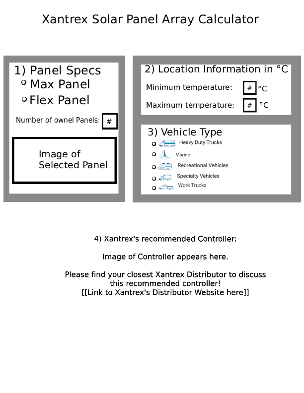

# Project Proposal

## Web App Name

**Solar Charge Controller Calculator - Xantrex**

## Team Member Roles for Proposal

| Member | Role |
|--------|------|
| Anas | Writeup Overview / Team Analysis & Roles |
| Greg | Writeup Overview |
| Erfan | Group meeting summaries / specific requirements - Epics |
| Anton | Deliverables |
| Huda | Introduction / Solar Array Calculations / Functional Epics |

---

## 1. Introduction

This project proposes the development of a Solar MPPT Controller Calculator that determines the correct MPPT solar charge controller based on user-provided solar panel specifications, environmental conditions, and battery bank voltage. The system ensures compliance with NEC standards and manufacturer safety requirements.

## 2. Project Objectives

- Accurately calculate solar array electrical parameters.
- Apply National Electrical Code (NEC) Table 690.7(A) temperature correction factors to open circuit voltage.
- Filter MPPT controllers based on battery bank voltage compatibility.
- Select a controller rated appropriately for voltage and current requirements.
- Ensure short circuit current safety validation based on manufacturer datasheets (Victron's Datasheets).

## 3. Solar Array Calculations

### 3.1 Total Power

**Formula:** `Total Power = PMAX × Number of Panels`

### 3.2 Open Circuit Voltage (Corrected)

**Formula:** `Open Circuit Voltage = VOC × Panels in Series × Temperature Factor`

- Temperature Factor is based on NEC Table 690.7(A) for -13°F (-25°C).

### 3.3 Maximum Charge Current

**Formula:** `Max Charge Current = Total Power ÷ Battery Charge Voltage`

**Battery Charge Voltage:**

- 14.7V for 12V battery bank
- 29.4V for 24V battery bank

### 3.4 Short Circuit Current

**Formula:** `Short Circuit Current = ISC(victron datasheet) × Panels in Parallel`

---

## 4. Writeup Overview

### 4.1 Project Abstract

Our group proposes the development of a browser-based application called the Solar Charge Controller Calculator, built in partnership with Xantrex. The application aims to help end customers determine the correct MPPT (Maximum Power Point Tracking) solar charge controller for their solar panel installation. Users would input their solar panel specifications—such as maximum power (PMAX), open circuit voltage (VOC), short circuit current (ISC), and panel configuration in series and parallel—along with their battery bank voltage and geographic location. The system would then perform NEC-compliant electrical calculations, apply location-based temperature correction factors retrieved via the OpenWeatherMap REST API, and recommend the most appropriately sized Xantrex MPPT controller that satisfies all voltage, current, and short circuit safety requirements. The proposed application also includes a secure administrative backend with login authentication, allowing authorized Xantrex personnel to manage the controller database through full CRUD operations, ensuring the calculator always reflects the current product lineup. This project fulfills the course requirements by incorporating a login system and integrating at least one web REST API for real-time weather data retrieval.

### 4.2 Overview of Existing Systems

Currently, selecting the correct MPPT charge controller is a manual and error-prone process. Customers are expected to read and interpret solar panel datasheets on their own, manually look up NEC Table 690.7(A) temperature correction factors, perform voltage and current calculations by hand or with generic spreadsheets, and then cross-reference their results against individual controller specification sheets to find a compatible unit. This workflow demands a level of electrical engineering knowledge that most end customers simply do not have.

### 4.3 How This Project Improves on Existing Solutions

This project proposes to consolidate the entire selection workflow into one web application where the user simply enters their panel specs and location, and the system handles the rest. It would automate NEC temperature correction using real weather data from the OpenWeatherMap API, perform manufacturer-specific short circuit current validation, and intelligently select the smallest compatible controller to optimize cost.

### 4.4 Target Audience

Xantrex end customers home-owners

### 4.5 Scope of the Project

The project covers a full-stack web application: a public calculator interface, backend NEC-standard computation logic, OpenWeatherMap API integration for temperature correction, a Xantrex controller database, and a secure admin CRUD interface with login authentication. Wiring diagram generation, e-commerce integration, and battery banks beyond 12V/24V are outside the current scope and may be addressed in future iterations.

---

## 5. Functional and Required Epics

### Epic 1: Solar Array Calculation Engine

- **Goal:** Develop backend logic to compute Total Power, Corrected Open Circuit Voltage, Maximum Charge Current, and Short Circuit Current based on user inputs.
- **Description:** Use Solar Array Calculation (3) for computation.
- **Value:** Accurate electrical calculations ensure proper MPPT controller sizing and prevent system overload or unsafe installations.
- **Acceptance Criteria:**
  - User inputs PMAX, VOC, ISC.
  - The user specifies the number of panels in series and parallel.
  - Temperature factor is applied automatically.
  - Battery bank voltage (12V or 24V) affects charge current calculation.
  - All computed values are displayed clearly.

### Epic 2: NEC Temperature Correction Implementation

- **Goal:** Apply NEC-compliant voltage correction factors to ensure safe controller sizing under cold temperature conditions.
- **Description:** The calculator will:
  - Users will input their regional temperature.
  - Apply Temperature Correction Factor (T°Factor) based on -13°F (-25°C).
  - Use voltage correction values from NEC Table 690.7(A).
  - Automatically adjust VOC for worst-case cold temperature conditions.
- **Value:** Ensures electrical safety and regulatory compliance.
- **Acceptance Criteria:**
  - The system includes NEC-based correction factors.
  - Open Circuit Voltage is multiplied by T°Factor.
  - Calculation reflects cold-climate voltage rise.
  - Factors can be updated if standards change. (Future Iteration)

### Epic 3: MPPT Controller Compatibility Filtering

- **Goal:** Filter available MPPT controllers based on battery bank voltage (12V or 24V).
- **Description:** The system will:
  - Filter controllers compatible with:
    - 12V battery bank
    - 24V battery bank
  - Only display MPPT controllers supporting the selected voltage system.
- **Value:** Prevents incompatible controller selection and reduces configuration errors.
- **Acceptance Criteria:**
  - The user selects battery bank voltage (12V or 24V).
  - Controller list updates accordingly.
  - Incompatible controllers are excluded.

### Epic 4: Controller Sizing Logic

- **Goal:** Select the closest MPPT controller rated above both calculated Open Circuit Voltage and Maximum Charge Current.
- **Description:** The system will:
  - Compare calculated:
    - Open Circuit Voltage
    - Max Charge Current
  - Select the closest MPPT controller rated above or equal to both values.
  - Prefer the smallest compatible controller (closest match).
- **Business Logic:** Controller must satisfy:
  - **Controller VOCrating ≥ Array Open Circuit Voltage** — The controller must be able to handle at least as much voltage as the solar panels can produce.
  - **Controller Currentrating ≥ Max Charge Current** — The controller must be able to handle at least as much current as the system will send into the battery.
- **Value:** Optimizes cost while maintaining safety.
- **Acceptance Criteria:**
  - The system evaluates both voltage and current ratings.
  - Only controllers meeting both thresholds are shown.
  - The closest-rated match is selected.

### Epic 5: Short Circuit Current Safety Validation

- **Goal:** Verify the selected controller supports the calculated Short Circuit Current as per manufacturer datasheets (Victron Datasheet Compliance).
- **Description:** The system will:
  - Compare calculated Short Circuit Current
  - Validate it against the controller's maximum PV short circuit current rating (per manufacturer datasheet).
  - Exclude controllers that fail this safety requirement.
- **Business Rule:** **Controller ISCrating ≥ Array Short Circuit Current** — The controller must be able to safely handle the maximum short-circuit current coming from the solar panels.
- **Value:** Prevents controller damage and ensures manufacturer compliance.
- **Acceptance Criteria:**
  - Short Circuit Current is calculated.
  - Controller's ISC rating is verified.
  - Incompatible controllers are removed.
  - Final recommendation meets voltage, current, and ISC requirements.

### Epic 6: Admin Authentication and Controller Database Management

- **Goal:** Provide a secure administrative interface for managing the Xantrex controller database used by the calculator.
- **Description:**
  - Require admin login with authenticated credentials to access the management dashboard.
  - Allow administrators to perform full CRUD operations on the controller database:
    - **Create:** Add new Xantrex controllers with voltage rating, current rating, ISC rating, and battery bank compatibility
    - **Read:** View all controllers currently in the database.
    - **Update:** Edit specifications of existing controllers (e.g., updated ratings, new model revisions).
    - **Delete:** Remove discontinued or obsolete controllers from the database.
- **Value:** Allows authorized personnel to maintain an accurate and up-to-date controller catalog without requiring code changes, ensuring the calculator always recommends current Xantrex products.
- **Acceptance Criteria:**
  - Admin must log in with valid credentials to access the dashboard.
  - Unauthorized users cannot access the management interface.
  - Admin can add, view, edit, and delete controller entries.
  - The public calculator uses the updated controller data in real time.
  - Input validation prevents incomplete or invalid controller entries.

### Epic 7: Weather API Integration and Automatic Temperature Correction

- **Goal:** Automatically retrieve location-based temperature data via a REST API to apply the correct voltage correction factor for the user's region.
- **Description:**
  - Allow the user to input their city or region.
  - Send a request to the OpenWeatherMap API to retrieve the historical minimum temperature for that location.
  - Map the retrieved temperature to the appropriate voltage correction factor.
  - Automatically apply the correction factor to the Open Circuit Voltage calculation.
  - Display the retrieved temperature and applied correction factor to the user for transparency.
  - If the api fails, ask for the minimum and maximum temperature of the region manually.
- **Value:** Provides location-specific voltage correction rather than assuming a fixed worst-case temperature, resulting in more accurate and cost-effective controller recommendations tailored to the user's actual climate.
- **Acceptance Criteria:**
  - The user can input their city or region.
  - The system successfully calls the OpenWeatherMap API and retrieves temperature data.
  - The correct correction factor is selected based on the retrieved temperature.
  - The correction factor is applied to the Open Circuit Voltage calculation automatically.
  - If the API call fails, the system asks the user for a maximum and minimum temperature in their region.
  - The user can see what temperature and correction factors were applied.

---

## 6. System Workflow

1. User inputs PMAX, VOC, ISC, number of panels in series and parallel.
2. The user selects battery bank voltage (12V or 24V).
3. The system calculates all required electrical parameters.
4. Controllers are filtered based on battery compatibility.
5. The system selects controller meeting voltage, current, and short circuit requirements.
6. The closest compatible MPPT controller is displayed.

---

## Team Analysis & Roles

### Anas (Backend & Frontend)

Anas has a decent backend experience, primarily in Python, and is eager to work with Java as well. On the frontend side, he has experience with Next.js (React & TypeScript) and Tailwind CSS, and works best when the UI design is already sketched out. His role will focus on backend calculation logic and API integration (Epics 1, 2, and 7), with contributions to frontend implementation once designs are provided.

### Greg (Backend Logic & Datasheet Research)

Greg brings experience with Spring Boot and Java, and has a background working with datasheets, making him well-suited for extracting and organizing Xantrex controller specifications. His role will center on the controller sizing and validation logic (Epics 4 and 5), as well as researching and populating the controller database with accurate datasheet data.

### Anton (Frontend & UI Development)

Anton is comfortable with frontend technologies including JavaScript, HTML, CSS, and Tailwind CSS. He is also interested in gaining backend experience. His role will focus on building the public-facing calculator UI and the admin dashboard interface (Epics 3 and 6 frontend), with opportunities to contribute to backend endpoints as a learning experience.

### Erfan (Design & UI/Frontend)

Erfan is open to all areas and has an interest in design and UI work. His role will involve creating the UI/UX designs and mockups that guide frontend development, and contributing to frontend implementation. He will work closely with Anton on the user-facing calculator and admin interfaces, and assist with Epic 7's frontend display of weather and correction factor data.

### Huda (Project Management, Testing & Documentation)

Huda's role will focus on the frontend and project management, coordinating deliverables and timelines, writing documentation, and developing the testing strategy. She will also contribute to QA and validation testing across all epics, ensuring the calculations and controller recommendations are accurate and meet acceptance criteria.

---

## 7. Technical Terms

### 7.1 Temperature Correction Factor (T° Factor)

A multiplier used to increase voltage calculations in cold weather. Cold temperatures increase solar panel voltage.

- **Comes from:** NEC Table 690.7(A)

### 7.2 NEC (National Electrical Code)

A safety rulebook for electrical installations in North America. It ensures safe wiring, proper equipment sizing and fire prevention.

- **In This Project:** Used for voltage correction in cold climates.

### 7.3 Battery Charge Voltage

The voltage required to properly charge a battery.

### 7.4 Max Charge Current

The maximum current that flows from the controller into the battery during charging.

### 7.5 MPPT (Maximum Power Point Tracking)

A type of solar charge controller that optimizes power from panels and adjusts voltage to maximize efficiency.

### 7.6 Controller Voltage Rating

The maximum solar panel voltage the controller can safely handle.

### 7.7 Controller Current Rating

The maximum charging current the controller can deliver to the battery.

### 7.8 Controller ISC Rating

The maximum short-circuit current the controller can tolerate from the solar array.

---

## 8. Meeting Summary

### Meeting 1 - January 22, 2025 (In-Person)

Our first group meeting served as an introduction where all five members got to know each other. Each member shared their background in computer science, including previous coursework, programming languages they are comfortable with, and areas of strength. This helped the group understand what each person can contribute and laid the groundwork for assigning roles in future iterations.

### Meeting 2 - February 10, 2025 (In-Person)

The group met to review the project requirements outlined in the proposal assignment. We discussed the deliverables, marking criteria, and the expectations for each iteration. We also prepared a list of questions to bring to our first meeting with the client, covering topics such as user type, authentication needs, database requirements, API usage, integration with the existing Xantrex website, and desired features.

### Meeting 3 - February 11, 2025 (Client Meeting with Ling Weng and Angela Shi)

We met with our clients Ling Weng and Angela Shi from Xantrex. Key takeaways from the meeting included that the calculator is intended for end customers rather than internal staff, so no login is required from Xantrex's perspective. The core functionality involves the user inputting solar panel specifications and receiving a recommended Xantrex controller along with a generated wiring diagram. The client emphasized ease of use and consistency with the existing Xantrex website design. Location-based temperature data was discussed as an important factor for accurate calculations, with maximum temperature being the primary input and minimum temperature being optional but desirable. The client also mentioned the possibility of redirecting users to a purchase page after receiving their result. The group was tasked with researching the calculation standards and coming up with the logic independently.

### Meeting 4 - February 17, 2025 (Online)

The group met to divide the proposal workload among members. Roles were assigned as follows: Greg is handling the writeup overview, Erfan is responsible for group meeting summaries and mandatory requirements, Anton is managing deliverables, and Huda is writing the introduction and functional epics. We are planning to meet again on either February 24 or 26 after class to discuss roles and tasks for iteration 1.
